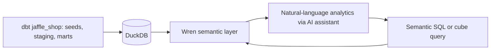
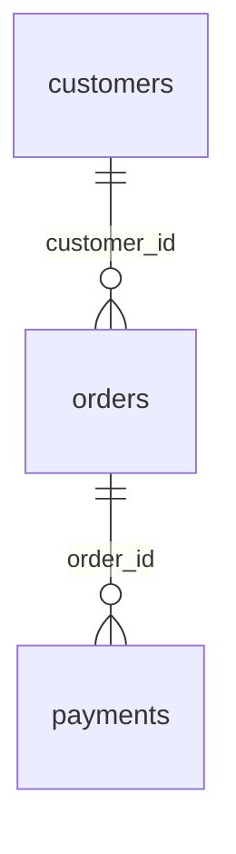

# Jaffle Shop Analytics

A business-focused Wren semantic layer over a dbt-built DuckDB warehouse. This project turns customer, order, and payment data into consistent metrics that an analyst or AI assistant can query without reconstructing joins and financial definitions each time.

**Validated snapshot:** 100 customers · 99 orders · 113 payments · AUD 1,672 in total order amount.

## Business problem

Questions such as “How much did customers spend?” depend on grain, currency, order status, and payment handling. Joining orders directly to multiple payments can inflate totals; dividing already-converted amounts by 100 can understate them; treating returned orders as refunds can invent financial activity absent from the data.

This project makes those decisions explicit through documented models, relationships, a reusable metrics cube, and a monthly summary view. It demonstrates schema discovery, semantic modeling, reconciliation, and reproducible analytics on a small retail dataset.

## Architecture



dbt prepares the source data. DuckDB stores the customer and order marts and staging views. Wren maps those objects into business-facing models and executes queries against the database. An AI assistant can use the definitions and business rules to translate questions into semantic SQL or structured cube queries.

**Implemented and tested:** semantic SQL, the metrics cube, the monthly view, and data-quality queries. A standalone chat application, hosted service, and automated natural-language evaluation suite are future work.

## Tools used

These versions were observed in the working environment. They are a reproduction baseline, not a compatibility guarantee for every machine.

| Tool | Observed version | Role |
|---|---|---|
| Python | 3.14.4 | Local runtime and virtual environment |
| dbt Core | 1.12.5 | Upstream transformations |
| dbt-duckdb | 1.11.0 | DuckDB adapter for dbt |
| DuckDB | 1.5.5 | Local analytical database |
| Wren AI CLI | 0.15.0 | Semantic definitions, validation, compilation, and queries |
| PowerShell | - | Windows setup and CLI workflow |
| YAML and SQL | - | Version-controlled definitions and business logic |

## Semantic models and relationships

| Model | Physical object | Grain and purpose |
|---|---|---|
| [customers](models/customers/metadata.yml) | `jaffle_shop.main.customers` | One row per customer, including those without orders; includes lifetime order count and payment value. |
| [orders](models/orders/metadata.yml) | `jaffle_shop.main.orders` | One row per order, with date, status, total amount, and payment-method amounts. |
| [payments](models/payments/metadata.yml) | `jaffle_shop.main.stg_payments` | One row per payment; staging already converts raw cents to AUD. |



[relationships.yml](relationships.yml) declares two many-to-one joins:

- `orders.customer_id = customers.customer_id`
- `payments.order_id = orders.order_id`

These joins are supported by upstream dbt definitions and live-data checks. DuckDB reported no physical key constraints, so semantic keys express verified data expectations rather than database-enforced constraints.

Raw seed tables and duplicate staging representations are not exposed as additional business entities. Wren's internal namespace is `wren.public`; physical objects remain in `jaffle_shop.main`.

## Defined business metrics

The [order_metrics cube](cubes/order_metrics/metadata.yml) uses `orders`, with status and order-date dimensions.

| Metric | Definition | Interpretation |
|---|---|---|
| `order_count` | `COUNT(*)` | Number of orders in the selected scope. |
| `purchasing_customers` | `COUNT(DISTINCT customer_id)` | Customers who ordered in that scope; not additive across months or statuses. |
| `total_order_amount` | `SUM(amount)` | Recorded AUD amount across all statuses and payment methods. |
| `average_order_value` | `AVG(amount)` | Mean AUD amount per order with a non-null amount. |
| `completed_order_amount` | `SUM(CASE WHEN status = 'completed' THEN amount ELSE 0 END)` | AUD amount for completed orders only. |

The [monthly_order_summary view](views/monthly_order_summary/sql.yml) exposes the same five measures by order month. Customer lifetime measures are available directly from `customers`.

**Financial interpretation:** total order amount includes coupons, gift cards, and returned-order statuses. It is not net revenue or refund-adjusted revenue. No explicit refund transactions are modeled. Aggregate amounts at order grain; aggregate payments per order before joining them to order-level metrics. See the [business rules](knowledge/rules/general.md) for null handling, date conventions, and lifetime-measure guidance.

## Example business questions

- How many orders and purchasing customers did we have each month?
- What was the average order value by month or order status?
- How much order amount came from completed orders?
- Which customers have the highest lifetime recorded payment value?
- How is payment amount distributed across credit cards, coupons, bank transfers, and gift cards?
- How many customers have never placed an order?

## Validated results from the first query workflow

The initial business-query workflow queried the monthly view and structured metrics cube. Both returned matching monthly order counts, total amounts, and average order values.

| Order month | Orders | Purchasing customers | Total order amount (AUD) | Average order value (AUD) | Completed-order amount (AUD) |
|---|---:|---:|---:|---:|---:|
| January 2018 | 29 | 24 | 496.00 | 17.10 | 424.00 |
| February 2018 | 27 | 25 | 415.00 | 15.37 | 400.00 |
| March 2018 | 35 | 31 | 622.00 | 17.77 | 279.00 |
| April 2018 | 8 | 8 | 139.00 | 17.38 | 0.00 |
| **Overall** | **99** | **62** | **1,672.00** | **16.89** | **1,103.00** |

Overall purchasing customers is independently deduplicated, not the sum of monthly counts. Overall average order value is calculated over orders, not by averaging monthly averages. Displayed amounts are rounded to two decimals; the source uses `DOUBLE`.

These are observed sample-data results, not current operational sales or evidence that every calendar month is complete.

## Data-quality checks performed

| Check | Observed result |
|---|---|
| Wren strict validation | Passed: 3 models, 1 view, 2 relationships |
| MDL compilation | Successfully generated `target/mdl.json` |
| Customer primary key | 100 rows, 100 distinct keys, 0 null keys |
| Order primary key | 99 rows, 99 distinct keys, 0 null keys |
| Payment primary key | 113 rows, 113 distinct keys, 0 null keys |
| Orders without a matching customer | 0 |
| Payments without a matching order | 0 |
| Order amount vs. summed payments on matched orders | 0 mismatches at tolerance `0.000001` |
| Missing order amounts | 0 |
| Customer lifetime aggregate reconciliation | AUD 1,672 and 99 orders, matching order totals |
| Monthly view vs. cube | Matching monthly counts, amounts, and averages |

These were manual validation queries through Wren, not an automated regression suite. Customer lifetime reconciliation was checked at aggregate level, not individually per customer. Upstream dbt tests were inspected for modeling context; a fresh dbt test run was not part of this Wren validation workflow.

## Setup and reproduction on Windows

### 1. Prepare the workspace

Use PowerShell and Python 3.11 or later; the observed environment used Python 3.14.4. This repository contains the Wren layer, not the upstream dbt project, seeds, or generated database. Supply a matching dbt `jaffle_shop` project separately, or use an existing database with the physical objects listed above.

Commands below assume this relative layout:

```text
workspace/
├── jaffle_shop_duckdb/       # Upstream dbt project and local database
└── jaffle-wren/             # This repository; run commands here
```

Create a virtual environment inside this repository. Calling its executables directly avoids activation-policy issues:

```powershell
py -m venv .venv
& .\.venv\Scripts\python.exe -m pip install "wrenai==0.15.0" "dbt-core==1.12.5" "dbt-duckdb==1.11.0" "duckdb==1.5.5"
$env:PYTHONIOENCODING = 'utf-8'
& .\.venv\Scripts\wren.exe --version
```

### 2. Prepare the upstream DuckDB database

Skip rebuilding if the matching database already exists. Otherwise, configure a local `profiles.yml` in the upstream dbt directory with the profile name expected by its `dbt_project.yml`:

```yaml
jaffle_shop:
  target: dev
  outputs:
    dev:
      type: duckdb
      path: jaffle_shop.duckdb
      schema: main
      threads: 1
```

From this repository, run the upstream project using the environment created above:

```powershell
$dbtExe = (Resolve-Path '.\.venv\Scripts\dbt.exe').Path
Push-Location '..\jaffle_shop_duckdb'
try {
    & $dbtExe debug --profiles-dir .
    if ($LASTEXITCODE -ne 0) { throw 'dbt debug failed' }
    & $dbtExe build --profiles-dir .
    if ($LASTEXITCODE -ne 0) { throw 'dbt build failed' }
} finally {
    Pop-Location
}
```

The expected file is `../jaffle_shop_duckdb/jaffle_shop.duckdb`, with `customers`, `orders`, and `stg_payments` in schema `main`. The filename matters because Wren models reference catalog `jaffle_shop`. Different upstream seeds or transformations can produce different results. See the [official DuckDB profile documentation](https://docs.getdbt.com/docs/local/connect-data-platform/duckdb-setup#connecting-to-duckdb) for connection fields.

### 3. Configure the local Wren profile

The project already declares `profile: jaffle-shop`; no reinitialization is needed. If that profile is already configured correctly, proceed to validation. Otherwise, generate a local connection file from the resolved directory using forward slashes:

```powershell
$duckdbDirectory = (Resolve-Path '..\jaffle_shop_duckdb').Path.Replace('\', '/')
$connectionJson = @{
    datasource = 'duckdb'
    url = $duckdbDirectory
    format = 'duckdb'
} | ConvertTo-Json
[System.IO.File]::WriteAllText(
    (Join-Path (Get-Location) 'connection.local.json'),
    $connectionJson,
    [System.Text.UTF8Encoding]::new($false)
)

& .\.venv\Scripts\wren.exe docs connection-info duckdb
& .\.venv\Scripts\wren.exe profile add jaffle-shop --from-file connection.local.json --activate
```

The URL is the **directory containing the database**, not the file. Writing UTF-8 without a byte-order mark also avoids JSON parsing issues on Windows PowerShell 5.1. The local connection file is ignored by Git. Import replaces an existing profile with the same name, so use it only when setting up or correcting this connection. Wren stores profiles outside the repository; see the [official Wren connection guide](https://github.com/Canner/WrenAI/blob/main/docs/core/guides/connect.md).

### 4. Validate, build, and query

Run from this repository in a PowerShell session with UTF-8 output enabled:

```powershell
$env:PYTHONIOENCODING = 'utf-8'
& .\.venv\Scripts\wren.exe context validate --strict
if ($LASTEXITCODE -ne 0) { throw 'Wren validation failed' }
& .\.venv\Scripts\wren.exe context show
& .\.venv\Scripts\wren.exe context build
if ($LASTEXITCODE -ne 0) { throw 'Wren build failed' }

& .\.venv\Scripts\wren.exe --sql "SELECT * FROM monthly_order_summary ORDER BY order_month"
& .\.venv\Scripts\wren.exe cube query --cube order_metrics --measures order_count,purchasing_customers,total_order_amount,average_order_value,completed_order_amount
& .\.venv\Scripts\wren.exe cube query --cube order_metrics --measures total_order_amount,order_count,average_order_value --time-dimension 'order_date:month'
```

`context show` should report `jaffle-shop-analytics`, three models, one view, and two relationships. Query totals should match the snapshot when using the same upstream data. `target/` is generated locally and intentionally excluded from Git.

## Key challenges solved

- **Windows connection path:** the original profile contained an extra leading slash before the Windows drive prefix, causing directory canonicalization to fail. Resolving the actual directory and normalizing separators fixed the connection.
- **UTF-8 CLI output:** the default Windows output encoding could not represent characters in Wren's skill text, causing a `UnicodeEncodeError`. Setting `PYTHONIOENCODING=utf-8` fixed Python CLI output for the session.
- **Physical vs. semantic namespaces:** table references use the real DuckDB catalog and schema while Wren's namespace remains `wren.public`.
- **Currency and aggregation grain:** staging already converts cents to AUD. Descriptions and business rules prevent repeated conversion and inflated totals from payment joins.
- **Schema-driven modeling:** actual database columns were used instead of relying on stale upstream descriptive metadata. Keys and joins were checked against live data.
- **Validation query planning:** a combined reconciliation query encountered a Wren planning error with reused aliases. Separate checks and a named payment-total CTE completed successfully without changing business logic.

## Completed dashboard and local Ask Wren demo

The completed dashboard is a responsive, snapshot-mode browser application at `apps/jaffle-shop-analytics`. It presents the validated Jaffle Shop sample with executive KPIs for customers, orders, purchasing customers, payments, total order amount, average order value, and completed-order amount. The monthly chart separates monetary series from order count, while the monthly table, customer ranking, order-status analysis, and data-quality cards expose the governed results. Total order amount includes every order status and is not revenue. Completed-order amount includes only completed orders.

The browser loads the unchanged Wren MDL and the exported customer, order, and payment snapshots. It uses `monthly_order_summary` for the unfiltered monthly view and the `order_metrics` cube expressions for filtered metrics and KPIs. The dashboard keeps the `orders_customers` and `payments_orders` relationships and the business rules for order grain, payment aggregation, status handling, AUD amounts, and null checks.

### Start the local dashboard on Windows

Run this exact command from the `jaffle-wren` project directory:

```powershell
$env:PYTHONIOENCODING = 'utf-8'
& ..\.venv\Scripts\python.exe -B apps\jaffle-shop-analytics\local_service.py
```

Open [http://127.0.0.1:4174/](http://127.0.0.1:4174/). The service binds only to `127.0.0.1` and serves both the dashboard and its local question endpoint. Stop it with `Ctrl+C` in the PowerShell window. The browser engine loads from the pinned Wren WebAssembly package on unpkg, so the first page load requires internet access; the sample data itself is local.

### Ask Wren behavior

The dashboard includes searchable Suggested questions and 15 curated answers. Curated results are persisted in `verified-examples.json`, generated and independently validated through Wren, and labelled **Instant verified answer**. They are saved governed results, not newly generated AI responses.

An accepted arbitrary analytics question is sent to the local service, which invokes the authenticated Codex CLI from this project directory. Codex is restricted to a read-only sandbox, uses the Wren context and query tools, and returns structured SQL, result tables, models, and business-rule notes. Each returned SQL statement is independently validated and executed through Wren before it reaches the browser. New arbitrary questions are labelled **New analysis, typically 30 to 90 seconds**. Successful arbitrary answers are stored in the ignored local `local-cache.json` file and repeated questions are labelled **Cached answer**. Rejected, failed, or cancelled questions are never cached. The Clear local cache button removes that runtime file.

Security controls reject command-style, file-editing, credential, prompt-disclosure, unrelated, and non-analytics requests. The service accepts one question at a time, enforces a 500 character limit, never exposes authentication data or local paths in responses, and checks that project files remain unchanged. SQL write statements are rejected and only read-only governed queries are returned.

This is a local presentation demo over a fixed dbt Jaffle Shop sample snapshot. It is not a live warehouse connection, production service, revenue report, or deployment. Results depend on the bundled snapshot and the locally installed authenticated Codex CLI. Arbitrary questions are unavailable while the local service is stopped, but curated answers and the static dashboard remain usable.

## Future improvements

- Automate key, relationship, null, and reconciliation checks in CI.
- Add per-customer lifetime reconciliation and explicit checks for orders without payments.
- Publish or pin the upstream dbt project and seed revision for full reproducibility.
- Add a dependency lockfile and test setup on a clean Windows machine.
- Evaluate natural-language questions against expected SQL and answers.
- Add refund transactions and agreed net-revenue definitions before reporting net revenue.
- Consider fixed-precision monetary types upstream and test semantic-layer behavior.
- Add CI automation for the existing dashboard and semantic checks.

## Screenshots

Screenshots are pending. Add sanitized images under `docs/screenshots/` and replace these placeholders:

| Planned image | What it should demonstrate |
|---|---|
| Architecture or model graph | Customer, order, and payment lineage and relationships |
| Strict validation and context summary | Successful validation and model inventory |
| Monthly analytics output | Monthly counts, order amounts, and average order values |
| Natural-language walkthrough | A question, generated semantic query, and verified answer |

Before publishing screenshots, remove machine-specific paths and any connection or account details.
